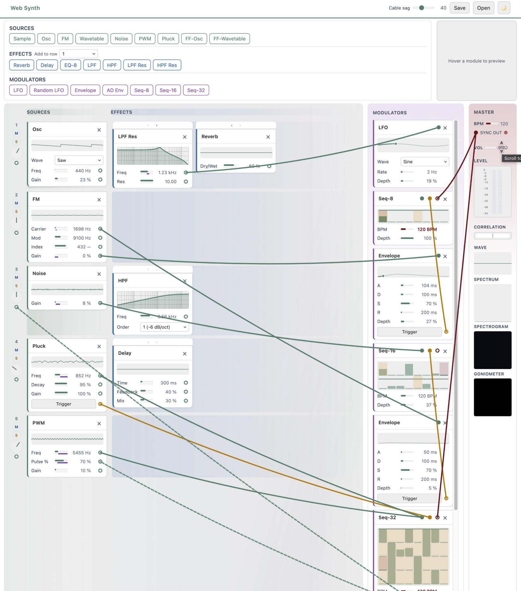

# Web Synth — プロジェクト概要

ブラウザ上で動作するモジュラーシンセ（Ableton Live 風）。**音源**・**エフェクト**・**モジュレータ**を配置し、ケーブルで接続。プロジェクトの保存・読み込みに対応。

---

## スクリーンショット

---

## 概要

| 項目 | 内容 |
|------|------|
| **エントリ** | `index.html` → `js/main.js`（ES モジュール） |
| **UI** | ヘッダー（Save / Open、Cable sag、テーマ）、ピッカー（SOURCES / EFFECTS / MODULATORS）、ラック、マスターパネル（BPM、Sync Out、Vol、Level、Wave / Spectrum / Spectrogram / Goniometer） |

---

## レイアウト

- **ラック**: 行 = 音源（1行1つ）+ エフェクトチェーン。行ごとに名前・パン（ノブ）・M/S・mute・solo。行はスクロール、ヘッダーは固定。
- **Modulators パネル**: マスターの左。LFO、Envelope、Seq-8/16/32 など。ここから音源・エフェクトのパラメータや行のパンにケーブル接続。
- **マスター**: BPM、Sync Out ジャック、Vol、L/R メーター、出力可視化（Wave / Spectrum / Spectrogram / Goniometer）。

---

## モジュール種別

- **source** — 1行に1つ（Osc, FM, Wavetable, Noise, PWM, Pluck, FF-Osc, FF-Wavetable, Sample）。
- **effect** — チェーン内: Reverb, Delay, EQ-8, LPF, HPF, LPF Res, HPF Res。
- **modulator** — Modulators パネル内: LFO, Random LFO, Envelope, AD Env, Seq-8, Seq-16, Seq-32。Pitch / Gate / 変調出力をケーブルでパラメータに接続。

---

## ケーブル

- 出力ジャックからドラッグ → 入力ジャックにドロップで接続。**入力**ジャックをドラッグしてドロップで切断。
- マスター **Sync Out** → シーケンサ **Sync In** で BPM 駆動のステップ進行。
- 変調ケーブル: 緑バー＝ベース値、紫バー＝変調範囲（接続時のみ表示）。

---

## 保存・読み込み

- **Save**: JSON をダウンロード（行、音源/エフェクト/モジュレータの種類と**全パラメータ**、接続、pan, mute, solo）。
- **Open**: JSON からラックとモジュレータを再構築し、パラメータと接続を復元。

---

## 主なファイル

| ファイル | 役割 |
|----------|------|
| **js/main.js** | エントリ、モジュール登録、ラック・ケーブル・オーディオ配線、保存・読み込み、マスター、モジュールプレビュー |
| **js/rack.js** | 行・スロット、addSourceRow / addEffectToRow / addModulator、パラメータバー |
| **js/cables.js** | SVG ケーブル、ジャック、接続・切断、スクロール時の再描画 |
| **js/audio-core.js** | AudioContext、マスターゲイン、アナライザー |
| **js/module-preview.js** | ピッカーでホバー時のプレビュー（モジュールをクローンして枠に合わせて表示） |
| **js/modules/** | 音源 / エフェクト / モジュレータ（base.js の契約に従う） |

---

## ドキュメント（確認用）

- **docs/architecture.md** — アーキテクチャ・ラック・ケーブル・保存・開発メモ。
- **docs/modules.md** — モジュール契約と一覧。
- **docs/processors.md** — AudioWorklet プロセッサ（LPF, HPF, PWM, Pluck）。
